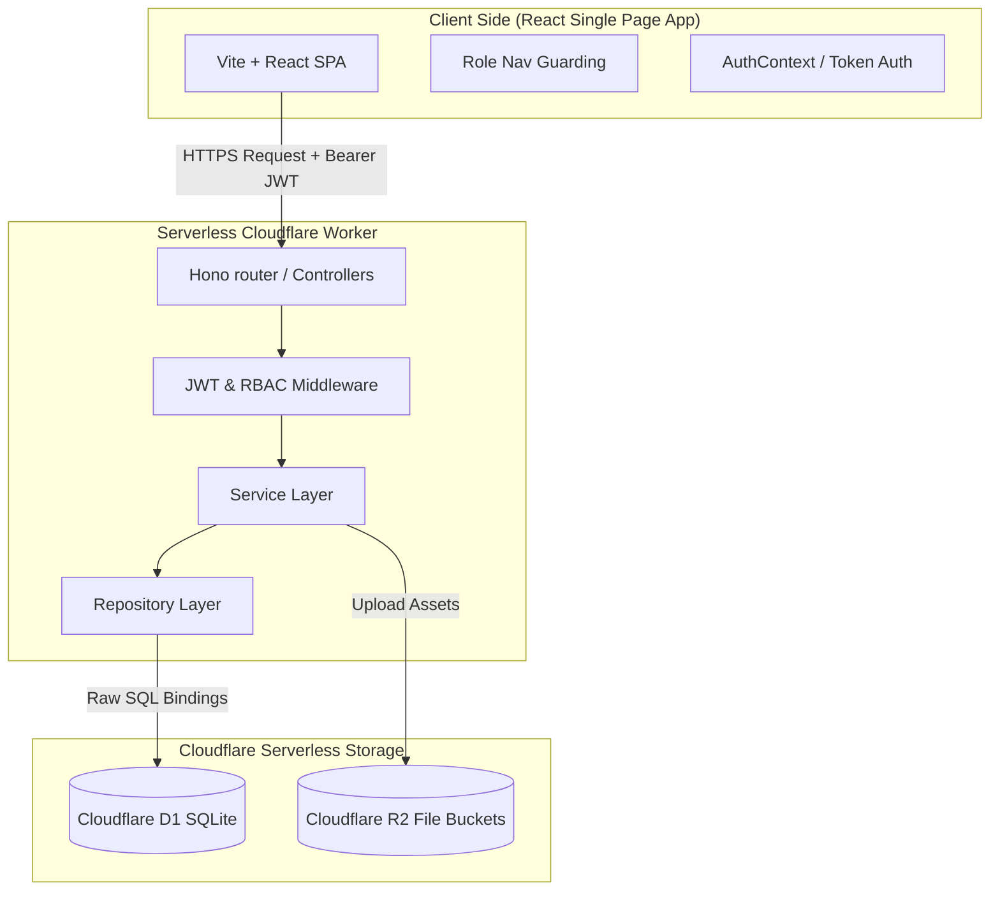

# 🏫 TrackFlow School ERP

TrackFlow is a production-ready, multi-tenant K-12 School Enterprise Resource Planning (ERP) platform designed to streamline administrative, academic, financial, and auxiliary school operations. The project uses a modern web stack, featuring a responsive React frontend styled with custom CSS and a serverless Cloudflare Workers backend powered by the Hono framework and SQLite-compatible Cloudflare D1 databases.

---

## 🗺️ System Architecture



---

## 🚀 Key Modules & Capabilities

### 1. People & Academics
- **Student 360° Profile**: Roster databases featuring student personal details, enrollment records, parent/guardian links, attendance metrics, results marksheets, and financial ledgers.
- **Teacher Workspace**: Teacher profile configurations, subject-to-section allocations, and class timetable maps.
- **Admissions Pipeline**: Streamlined lifecycle tracking prospective leads from **Admission Inquiry** to formal **Application Approval**, which automatically spawns the student login, links parents, and initiates fee invoices.
- **Course & Section Architecture**: Hierarchical organization mapping Departments ➜ Courses/Programs ➜ Classes/Sections ➜ Subjects.
- **Academic Calendar & Scheduling**: Global calendar planning holidays, exams, and school events, plus a dynamic slot-based weekly timetable scheduler.
- **Attendance Tracker**: Subject-wise student attendance registry and staff daily attendance logs.
- **Exams & Marksheets**: Complete assessment management supporting grading scales (Indian K-12 standards), marks entries, and print-ready report card compilation (calculating grade aggregates, percentages, and ranks).

### 2. Finance & Human Resources
- **Student Fees Ledger**: Invoice definitions, merit-based/sibling concessions (discounts), installment schedules, payment logs, and cash receipt generation.
- **Staff Leave System**: Leave types quota generation, teacher leave application logs, and multi-tier approval panels.
- **Automated Payroll Engine**: Staff salary structures linked to teacher attendance tracking systems to automatically process Loss of Pay (LOP) deductions and finalize printable monthly payslips.

### 3. Collaboration & Services
- **Audit Logs**: Detailed, timestamped record of administrative, academic, or financial actions for compliance.
- **Unified Approvals Queue**: Centralized approvals inbox routing student/teacher leaves and admission conversions.
- **Unified Documents & Notes**: Dynamic attachments repository and internal communication diaries pinned to students, teachers, and subjects.
- **Auxiliary Systems**: Visitor registry books, asset inventories, transport route allocations, and library book tracking logs.

---

## 📁 Repository Directory Structure

```text
simple_erp/
├── erp-backend/                    # Cloudflare Worker REST API
│   ├── db/                         # Database scripts
│   │   ├── schema.sql              # Core relational schema
│   │   ├── seed-school.sql         # Base data seeds (Roles, Admin, Demo School)
│   │   └── migration-*.sql         # Incremental feature migrations
│   ├── src/
│   │   ├── index.ts                # App entrypoint and dashboard endpoints
│   │   ├── types.ts                # TypeScript global bindings
│   │   ├── middleware/             # CORS and authentication handlers
│   │   ├── utils/                  # Helper functions
│   │   └── modules/                # Core business logic packages
│   │       ├── auth/               # User authentication
│   │       ├── students/           # Student profiles
│   │       ├── teachers/           # Teacher records
│   │       ├── weekly-timetable/   # Scheduler timetables
│   │       ├── fees/               # Billing systems
│   │       └── [other modules...]  # Domain-specific routes & repos
│   ├── package.json                # Backend dependency declarations
│   └── wrangler.jsonc              # Cloudflare services bindings
│
├── erp-frontend/                   # React Single-Page Application
│   ├── public/                     # Static client-side assets
│   ├── src/
│   │   ├── App.tsx                 # Route declarations & provider setups
│   │   ├── main.tsx                # Client bootstrapper
│   │   ├── index.css               # Main responsive design stylesheet
│   │   ├── components/             # Reusable UI widgets (Sidebar, Navbar, Layouts)
│   │   ├── config/                 # Configurations (e.g. role-based menus)
│   │   ├── contexts/               # React Context Providers (Auth, Toasts)
│   │   ├── routes/                 # Protected routes navigation guards
│   │   ├── services/               # REST API fetch clients
│   │   └── pages/                  # Route components
│   │       ├── Dashboard.tsx       # Multi-dashboard hub
│   │       ├── dashboards/         # Role-specific dashboard layouts
│   │       └── [other pages...]    # Roster views and setup panels
│   ├── package.json                # Frontend dependency declarations
│   └── vite.config.ts              # Vite configurations
│
└── product-spec/                   # Product requirements & UX standards
    ├── 00_vision.md                # System overview and tenant separation rules
    ├── 02_design_system.md         # Branding color tokens & grid standards
    └── [spec files...]             # Multi-layer requirements trees
```

---

## 🗄️ Database Schema Catalog

The system runs on SQLite (via Cloudflare D1). Key tables defined in [schema.sql](file:///D:/nakul/simple_erp/erp-backend/db/schema.sql) include:

### 1. Core Organization & Users
*   **`institutions`**: Multi-tenant schools. Contains setup thresholds, passing criteria, and logos.
*   **`users`**: Root accounts mapped to credentials. Extends to `user_roles` linking permissions.
*   **`roles` / `permissions` / `role_permissions`**: Relational RBAC schema enabling fine-grained control.
*   **`audit_logs`**: Capture of action scopes, modules, description and timestamp.

### 2. Academics & Timetables
*   **`academic_years`**: Active/Draft sessions defining enrollment periods.
*   **`departments`**: Divisions mapping teachers to heads (HOD).
*   **`courses`**: Academic programs (e.g., Grade 9, Class X).
*   **`sections`**: Subdivisions within courses mapping classrooms and class teachers.
*   **`subjects`**: Courses components mapping credit weights and semester numbers.
*   **`timetable_slots`**: Custom period slot configurations (Class periods, Recess breaks).
*   **`weekly_timetable`**: Matrix joining slots, subjects, sections, and teachers.

### 3. Students, Teachers & Attendance
*   **`students`**: Base records (demographics, blood groups, medical entries).
*   **`student_enrollments`**: Join table mapping students to academic years, courses, sections, and semesters.
*   **`teachers`**: Employee indices, hire dates, departments, designations.
*   **`teacher_subject_assignments`**: Assigns teachers to subject/section combinations.
*   **`student_attendance` / `attendance_sessions`**: Session-wise student presence markers.
*   **`teacher_attendance`**: Daily teacher presence markers.
*   **`guardians`**: Parent registry links mapped to students.

### 4. Evaluation & Assessment
*   **`exams`**: Term groupings (Midterm, Term-II).
*   **`exam_subjects`**: Specific assessment items indicating maximum/minimum marks.
*   **`student_marks`**: Obtained scoring outputs linked to students.
*   **`subject_lesson_plans`**: Tracks syllabus progression against subject topics.
*   **`subject_assessments`**: Granular internal assessments (quizzes, projects).

### 5. Finance & Human Resources
*   **`fee_structures`**: Flat fee templates per academic year and course.
*   **`student_fee_records`**: Student ledger card recording totals, payables, and due dates.
*   **`fee_payments`**: Transaction records tracking UPI, Cash, or Bank transfers.
*   **`fee_receipts`**: Serialized fiscal cash printouts.
*   **`teaching_allocations`**: Workload schedules recording teacher workload metrics.
*   **`approvals`**: Unified queue processing workflows (leave applications, registrations).

---

## 🔒 Role-Based Access Control (RBAC)

Dynamic visibility and authorization are enforced client-side via [roleNav.ts](file:///D:/nakul/simple_erp/erp-frontend/src/config/roleNav.ts) and server-side via [auth.ts](file:///D:/nakul/simple_erp/erp-backend/src/middleware/auth.ts).

| Role | Authorized Modules & Views | Target Dashboard View |
| :--- | :--- | :--- |
| **Super Admin / Admin** | Access to all setup panels, imports/exports, configuration values, and user managers. | [AdminDashboard.tsx](file:///D:/nakul/simple_erp/erp-frontend/src/pages/dashboards/AdminDashboard.tsx) |
| **Principal** | Full academic overview, leave approvals, marks overview, settings configurations. | [AdminDashboard.tsx](file:///D:/nakul/simple_erp/erp-frontend/src/pages/dashboards/AdminDashboard.tsx) |
| **HOD (Head of Department)** | Manage courses/sections, teachers rosters, calendar entries, and student leaves. | [AdminDashboard.tsx](file:///D:/nakul/simple_erp/erp-frontend/src/pages/dashboards/AdminDashboard.tsx) |
| **Teacher** | Access timetables, daily attendance grids, homework logs, and mark spreadsheets. | [TeacherDashboard.tsx](file:///D:/nakul/simple_erp/erp-frontend/src/pages/dashboards/TeacherDashboard.tsx) |
| **Accountant** | Collect fees, generate payment receipts, adjust concessions, and review financial statistics. | [AccountantDashboard.tsx](file:///D:/nakul/simple_erp/erp-frontend/src/pages/dashboards/AccountantDashboard.tsx) |
| **Student** | View personal dashboard, homework logs, class timetables, and print report cards. | [StudentDashboard.tsx](file:///D:/nakul/simple_erp/erp-frontend/src/pages/dashboards/StudentDashboard.tsx) |
| **Parent** | Monitor children's metrics (attendance meters, outstanding ledger records, marks). | [ParentDashboard.tsx](file:///D:/nakul/simple_erp/erp-frontend/src/pages/dashboards/ParentDashboard.tsx) |

---

## 🛠️ Getting Started & Setup

### Prerequisites
- Node.js (v18+)
- npm or yarn
- Wrangler CLI installed globally (`npm install -g wrangler`)

---

### Backend Setup (`erp-backend`)

1. **Install Dependencies**:
   ```bash
   cd erp-backend
   npm install
   ```

2. **Initialize Local SQLite Database**:
   Run schema creation inside the local Wrangler D1 Sandbox:
   ```bash
   npm run db:execute
   ```

3. **Seed Database**:
   Seed core values (roles, permissions, settings, and base test accounts):
   ```bash
   npm run seed-school
   ```

4. **Start Development Worker**:
   Run Hono API server locally (runs on port `8787` by default):
   ```bash
   npm run dev
   ```

---

### Frontend Setup (`erp-frontend`)

1. **Install Dependencies**:
   ```bash
   cd erp-frontend
   npm install
   ```

2. **Configure Environment Variables**:
   Create a `.env` file in `erp-frontend/` (if not present):
   ```env
   VITE_API_URL=http://localhost:8787
   ```

3. **Start Client Dev Server**:
   Launch the Vite development compiler:
   ```bash
   npm run dev
   ```

4. **Build for Production**:
   Compile assets into minified production files (output directory `dist/`):
   ```bash
   npm run build
   ```

---

## 🔗 Key Code References

- **Frontend Core Route Engine**: [App.tsx](file:///D:/nakul/simple_erp/erp-frontend/src/App.tsx)
- **Frontend Custom Styling**: [index.css](file:///D:/nakul/simple_erp/erp-frontend/src/index.css)
- **Role Navigation Matrix**: [roleNav.ts](file:///D:/nakul/simple_erp/erp-frontend/src/config/roleNav.ts)
- **Backend Entry Router**: [index.ts](file:///D:/nakul/simple_erp/erp-backend/src/index.ts)
- **Database Schema**: [schema.sql](file:///D:/nakul/simple_erp/erp-backend/db/schema.sql)
- **Product Specifications**: [Product Spec Directory](file:///D:/nakul/simple_erp/product-spec/)
